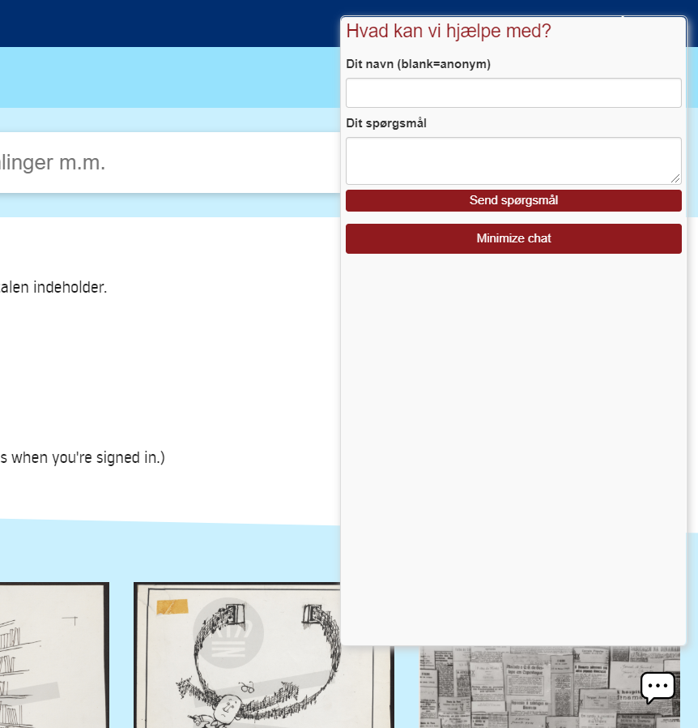

# KB-Primo-VE-libChat

**LibChat service**: includes a chat service, provided by libanswers/ springshare, onto the user interface (all pages).     
       
  
 
 
 # Create the package
 * npm install
 * npm run prepare
 
 # Install in Primo VE
 ```bash
 cd MYVIEW
 npm install kb-primo-ve-libchat --save-dev
 ```
 
 Set scriptIds constant in `js/main.js` like below:
 ```javascript 
    .constant('scriptIds' , {
        'en': 'XXXXXXXXXXX',
        'da': 'YYYYYYYYYYY'
    })
```

 Add to bottom of `js/main.js`
 ```javascript
 require('kb-primo-ve-libchat');
```